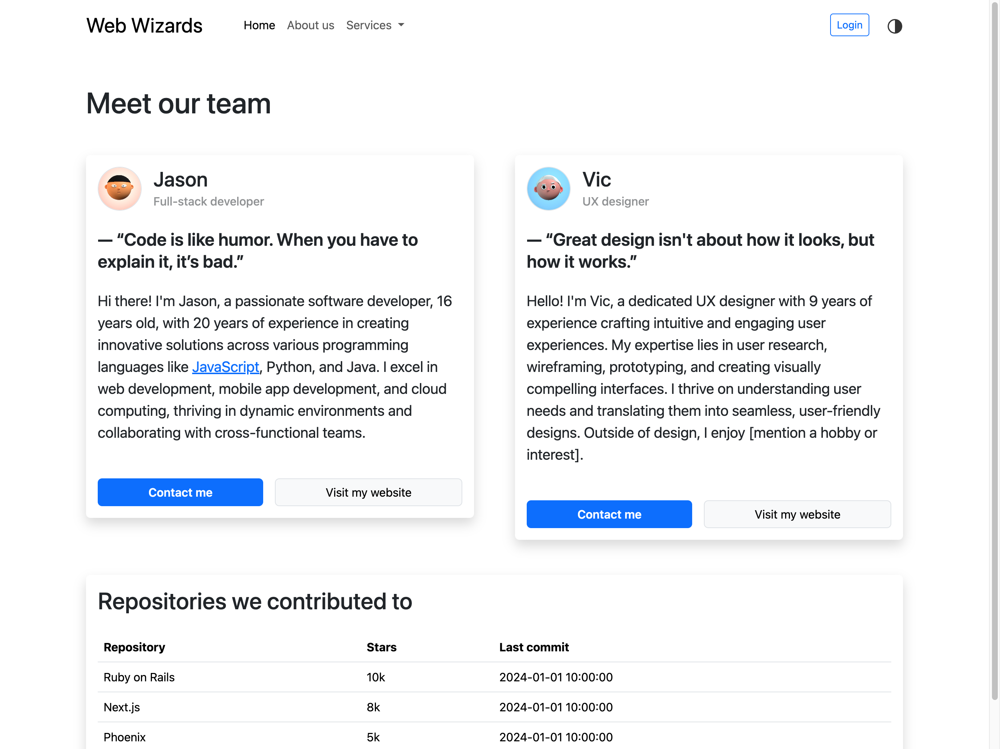

# Bootstrap 5 customization with CSS variables

Use Bootstrap’s CSS custom properties for fast and forward-looking design and development.

This repository is an example how to customize Bootstrap 5 with CSS variables.

## CSS variables vs Sass variables

This example uses CSS variables. Another method is to use [Sass variables](https://getbootstrap.com/docs/5.3/customize/sass/).

Sass variables in Bootstrap 5 are probably more convenient for customization, but also needs some setup.

## Documentation of available CSS variables

[Documentation Bootstrap 5 CSS variables](https://getbootstrap.com/docs/5.3/customize/css-variables/)

## Before / After

